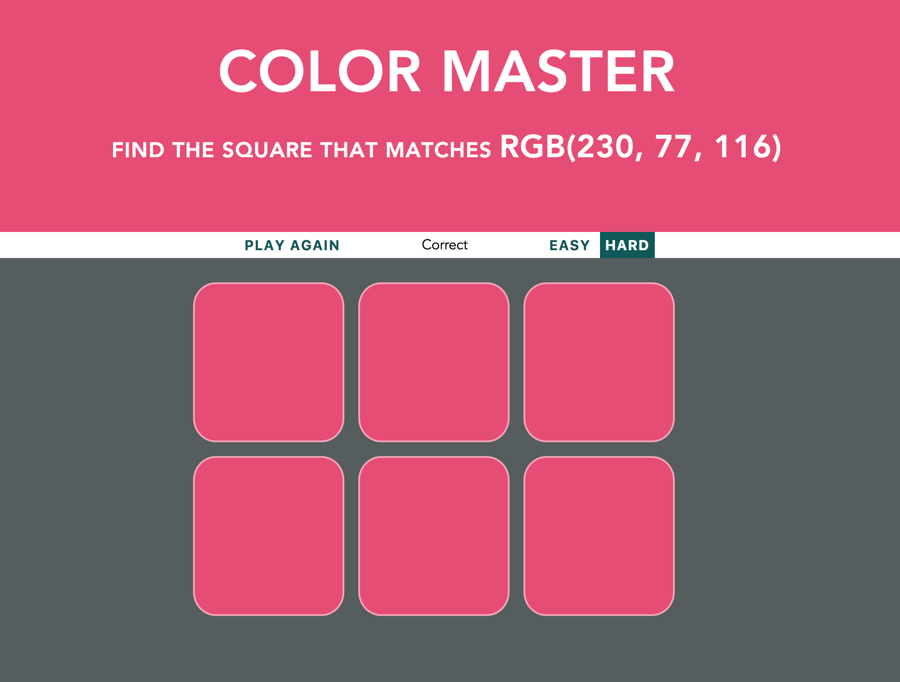

# Color Matching Game
Browser-based game where the player is given an RGB value and aims to choose the matching colored square from several options. Players can choose from an "Easy" or "Hard" mode and get multiple tries to guess the color correctly. 

### Technology
* Vanilla JS
* HTML5 & CSS3

### Instructions
1. Download the repository
2. Double click `index.html`
3. View in your browser

